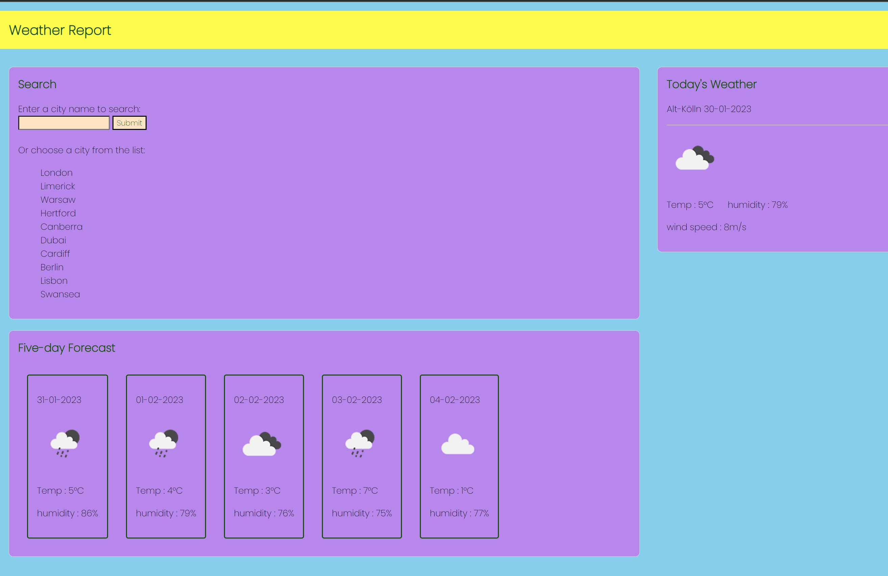

# It's Weather - Bootcamp challenge #8.

##  Weather Report
The current weather and five-day forecast anywhere in the world.

Thanks to the kind people at OpenWeatherMap.org.

Featuring everything and more, including:
* A weather dashboard with form input.
  * When a user searches for a city they are presented with current and future conditions for that city and that city is added to the search history
  * When a user views the current weather conditions for that city they are presented with:
    * The city name
    * The date
    * An icon representation of weather conditions
    * The temperature
    * The humidity
    * The wind speed
  * When a user view future weather conditions for that city they are presented with a 5-day forecast that displays:
    * The date
    * An icon representation of weather conditions
    * The temperature
    * The humidity
  * When a user click on a city in the search history they are again presented with current and future conditions for that city

## Deployment

### [repo](https://github.com/S-R-i-c-e/weather-report)
### [webpage](https://s-r-i-c-e.github.io/weather-report/)
javascript code, html rendering, CSS styling. 

## Installation
requires a web-browser - open index.html file.

## Screenshot

## Written by
Stephen Rice 30/01/2022